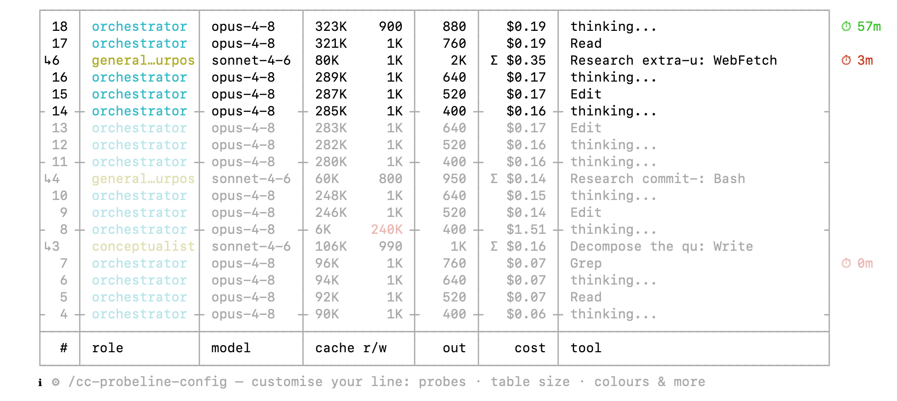
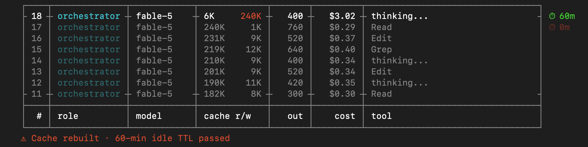

[](https://github.com/labzink/cc-probeline/releases)
[](https://github.com/labzink/cc-probeline/actions/workflows/test.yml)
[](LICENSE)


# See where it leaks. Stop paying for it.

A live dashboard right in your status line — surfacing what Claude Code hides: the cost of every turn, what your subagents spend, how long your cache stays alive, plus the usual limits, context and git.

**Stop overpaying for inefficiency you can't see. Spend your limits on purpose.**

**Install in one command:**

```sh
brew install labzink/homebrew-tap/cc-probeline
```
**[See all install options →](#install)**


## What the probe pulls out

Most status lines count things — tokens, turns, running agents. **The probe prices them.** Everything below comes out of your session's local log: data Claude Code has, but never shows you.

- **Every turn, priced** — not one opaque session total: a live table where each step lands with its own cost.
- **What your subagents spend** — subagent work is invisible while it runs. The probe puts each agent on the bill, live, next to your own turns.
- **Cache rebuilds, in dollars** — idle past the TTL (60 min for the orchestrator, 5 for subagents), and your next turn quietly rewrites the whole cache. The probe ages it live (⏱ 60m → 0m) and prices the rebuild when it hits.
- **Extra usage in money, not percent** — past 100% of your plan, the overage shows up in dollars before the invoice does.
- **Prices that stay correct** — your dollars are only as honest as the price table behind them. cc-probeline refreshes its rates over the network — one optional, opt-out check a day, never during render — so when Anthropic changes prices your totals follow within a day, no reinstall. Offline or opted out, it falls back to the table baked into the build.
- **5h / 7d limits with reset clocks** — watch them fill, know exactly when they free up.
- **Colour-coded zones** — numbers shift colour as they enter warning and critical territory, so the line catches your eye exactly when it should.
- Plus the table stakes: model, context, git, session time.


**Every turn lands on its own line — orchestrator and subagents alike — priced as it happens. Finally you see where every dollar of your reasoning actually goes.**

**Built to fit your terminal.** Don't like a segment, the colours, or the width? The `/cc-probeline-config` wizard walks you through it and writes the config for you — no hand-editing TOML. (That's the hint at the bottom of the dashboard above.)


**The moment you cross 100%, you'll see it — and the extra bill stays under your control.**


**You get warned while there's still time to act — not after you've hit the wall.**


**Cache rebuilds stop being silent — you see the price the moment they happen.**

And nothing about your session ever leaves your machine — that's [why it's called a probe](#why-its-called-a-probe).

## Why it's called a probe

A probe is an instrument of observation, not intervention. Everything cc-probeline does is read and display — it never reaches into your account or reports on you.

- **What it reads:** your session's JSONL log (`~/.claude/projects/…`) and the status-line payload Claude Code pipes directly to it.
- **What it doesn't touch:** credentials, keychain, OAuth tokens — no telemetry, ever. Rendering is fully offline; the only network it ever makes is one optional, opt-out price/version check a day — a plain download of a public file, sending nothing about your session. Turn it off and it never touches the network at all.
- **The binary:** single compiled Go binary, no runtime dependencies, one run ≈ 5 ms.
- **Auditable:** MIT license, open source, reproducible builds, releases published with SHA256 checksums.

## Install

**Homebrew** (macOS / Linux):

```sh
brew install labzink/homebrew-tap/cc-probeline
```

**curl** (macOS / Linux — downloads the release archive for your OS, verifies SHA256, installs the binary):

```sh
curl -fsSL https://raw.githubusercontent.com/labzink/cc-probeline/main/scripts/install.sh | sh
```

**Scoop** (Windows, experimental):

```powershell
scoop bucket add labzink https://github.com/labzink/scoop-bucket
scoop install cc-probeline
```

**Claude Code plugin marketplace:**

```
/plugin marketplace add labzink/cc-probeline
```

Then install the plugin from the `/plugin` menu (or `/plugin install cc-probeline`) and **restart Claude Code** — the slash commands below only show up after a restart.

Once restarted, run `/cc-probeline-install`: it detects your OS, installs the binary through the right channel (Homebrew / Scoop / curl) and wires the status line — asking before it runs anything. You can still install manually with any channel above. (Claude Code doesn't let a plugin set your active status line on its own, so this command does the wiring for you.) The plugin also gives you `/cc-probeline-update` to upgrade later and the `/cc-probeline-config` wizard.

**Verify your installation:**

```sh
cc-probeline --check
```

Prints `Installation OK`.

### Requirements

- Claude Code on macOS, Linux, or Windows.
- For the quota segment (5h / 7d limits, extra usage): Claude Code ≥ 2.1.80, which passes `rate_limits` in the status-line payload. On older versions the quota segment is hidden; everything else works normally.

### Configuration

Run the interactive wizard from inside Claude Code:

```
/cc-probeline-config
```

It walks you through probes, table size and colours — and writes the TOML for you. Or edit `~/.config/cc-probeline/config.toml` directly (validate with `cc-probeline check-config`):

```toml
[general]
table_rows = 10             # rows in the per-turn cost table (max 40)
no_color   = false          # true = plain monochrome output

[widgets]                   # flip any segment on/off
model = true
effort = true
cost = true
ctx = true
quota = true
git = true
project = true
email = true
time = true

[thresholds]
cost_budget_usd = 25        # turn the cost segment red past $25 (0 = off)

# Colour flips for the context bar — yellow / orange / red.
# Must strictly increase; bad values fall back to these defaults.
ctx_notice_ratio   = 0.50
ctx_warn_ratio     = 0.70
ctx_critical_ratio = 0.90

# Same three flips per rate-limit window. The 7d window mirrors these keys
# as quota_7d_notice_ratio / _warn_ratio / _critical_ratio.
quota_5h_notice_ratio   = 0.50
quota_5h_warn_ratio     = 0.70
quota_5h_critical_ratio = 0.90
```

Config is read in precedence order: `CC_PROBELINE_CONFIG=/path` (explicit override) → `.cc-probeline.toml` in the current repo (project-local) → `~/.config/cc-probeline/config.toml` (global). Every field is optional; missing fields use the built-in defaults, and an invalid value never breaks the status line — it falls back to the default.

Full reference: [`scripts/config.toml.example`](scripts/config.toml.example).

### Updating

When a newer release is out, the status line surfaces it: `↑ update: vX → vY — run /cc-probeline-update`. Run that command inside Claude Code and it upgrades through whichever channel you installed with (and installs it for you if the binary is missing). Or update by hand:

```sh
brew upgrade labzink/homebrew-tap/cc-probeline                                                   # Homebrew
scoop update cc-probeline                                                                        # Scoop
curl -fsSL https://raw.githubusercontent.com/labzink/cc-probeline/main/scripts/install.sh | sh   # curl (re-runs latest)
```

The update notice comes from a once-a-day price/version check; turn it off with `price_check = false` (or in the `/cc-probeline-config` wizard) and cc-probeline stays fully offline.

### Uninstall

First, restore your previous status line and remove cc-probeline's entry from Claude Code's settings:

```sh
cc-probeline uninstall
```

This puts the status line you had before back, byte-for-byte, if cc-probeline replaced one — otherwise it just removes cc-probeline's block. Then remove the binary through the channel you installed with:

```sh
brew uninstall cc-probeline      # Homebrew
scoop uninstall cc-probeline     # Scoop
rm "$(which cc-probeline)"       # manual / curl install
```

## The experiment

cc-probeline is a personal experiment: can you hand programming over to AI **entirely** — every line of code, every design decision — and still end up with a product that matches the operator's vision **exactly**?

This is the answer. Claude wrote all of it; the operator never touched the code. What the operator owned was everything that decides whether it's any good: the vision, the spec, the design direction, and every single call — reviewed detail by detail until the result was exactly right. A few weeks of spare-time work — competitor research, a written spec, phased design and implementation. The commit history is public and reads like a build log: you can watch the product take shape, phase by phase.

**Contributing:** bug reports and ideas are welcome — open an issue. Code contributions are possible, but they're not the primary path: the codebase is developed through an AI pipeline in tight collaboration with the author, so pull requests need to fit that workflow. When in doubt, open an issue first.

If cc-probeline ends up saving you money, you can send a little of it back: [GitHub Sponsors](https://github.com/sponsors/labzink)

MIT License.
