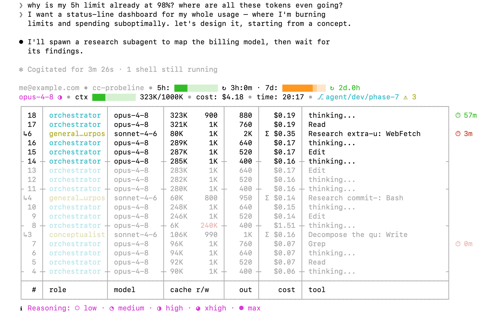

[](https://github.com/labzink/cc-probeline/releases)
[](https://github.com/labzink/cc-probeline/actions/workflows/test.yml)
[](LICENSE)

<!-- W5: badges resolve once the repo is public; the release badge lights up after the first tag -->

# See the waste. Stop paying for it.

A live dashboard, right in your Claude Code status line — everything it hides: the cost of every turn, what your subagents spend, how long your cache stays alive, plus the standard stuff (limits, context, git) and more. So you stop overpaying for inefficiency you can't see, and spend your limits on purpose.

**Install in one command:**

```sh
brew install labzink/homebrew-tap/cc-probeline
```
<!-- W5: verify the hero install command against the released tap -->
<sub>probe your Claude Code — [all install options](#install)</sub>


**Your whole session — in one line.**

## What the probe pulls out

Most status lines count things — tokens, turns, running agents. **The probe prices them.** Everything below comes out of your session's local log: data Claude Code has, but never shows you.

- **Every turn, priced** — not one opaque session total: a live table where each step lands with its own cost.
- **What your subagents spend** — subagent work is invisible while it runs. The probe puts each agent on the bill, live, next to your own turns.
- **Cache rebuilds, in dollars** — idle past the TTL, and your next turn quietly rewrites the whole cache. The probe ages it live (⏱ 60m → 0m) and prices the rebuild when it hits.
- **Extra usage in money, not percent** — past 100% of your plan, the overage shows up in dollars before the invoice does.
- **5h / 7d limits with reset clocks** — watch them fill, know exactly when they free up.
- Plus the table stakes: model, context, git, session time.


**Where your tokens and dollars actually go — turn by turn.** Orchestrator and subagents in one stream, every step priced.

Make the line yours: the `/cc-probeline-config` wizard (that hint at the bottom of the frame) tunes probes, table size and colours — and writes the config for you.


**The overage in dollars — before the invoice.** Cross 100% and the meter keeps counting: `+$3.80 extra usage`, live.


**A heads-up before you hit the wall.** The 5h window at 98% with its reset clock — and a subagent's cache expiring, flagged as it happens.


**What a cache rebuild actually costs.** One idle hour past the TTL → 240K tokens rewritten → $3.02. You see the price — and the countdown that would have warned you.

All of this comes from a single Go binary reading one local file in ~5 ms. No network calls, no credentials, nothing leaves your machine — that's [why it's called a probe](#why-its-called-a-probe).

## Why it's called a probe

A probe is an instrument of observation, not intervention. Everything cc-probeline does is read and display: two local sources, nothing else.

- **What it reads:** your session's JSONL log (`~/.claude/projects/…`) and the status-line payload Claude Code pipes directly to it.
- **What it doesn't touch:** credentials, keychain, OAuth tokens. No network calls. Nothing leaves your machine.
- **The binary:** single compiled Go binary, no runtime dependencies, one run ≈ 5 ms.
- **Auditable:** MIT license, open source, reproducible builds, releases published with SHA256 checksums.

## Install

**Homebrew** (macOS / Linux):

```sh
brew install labzink/homebrew-tap/cc-probeline
```

**curl** (macOS / Linux — downloads the release archive for your OS, verifies SHA256, installs the binary):

```sh
curl -fsSL https://raw.githubusercontent.com/labzink/cc-probeline/main/install.sh | sh
```

**Scoop** (Windows, experimental):

```powershell
scoop bucket add labzink https://github.com/labzink/scoop-bucket
scoop install cc-probeline
```

**Claude Code plugin marketplace:**

```
/plugin marketplace add labzink/cc-probeline
```

The plugin gives you discovery and the `/cc-probeline-config` wizard; the binary itself still comes from one of the channels above — Claude Code doesn't let a plugin become your active status line by itself.
<!-- W5: verify all install commands above against the released artifacts; verify plugin wiring wording -->

**Verify your installation:**

```sh
cc-probeline --check
```

Prints `Installation OK`.

### Requirements

- Claude Code on macOS, Linux, or Windows.
- For the quota segment (5h / 7d limits, extra usage): Claude Code ≥ 2.1.80, which passes `rate_limits` in the status-line payload. On older versions the quota segment is hidden; everything else works normally.

### Configuration

Run the interactive wizard from inside Claude Code:

```
/cc-probeline-config
```

It walks you through probes, table size and colours — and writes the TOML for you. Or edit `~/.config/cc-probeline/config.toml` directly (validate with `cc-probeline check-config`):

```toml
[widgets]
git = true                  # any segment on/off

[thresholds]
cost_budget_usd = 25        # warn when the session passes $25

[theme]
name = "high-contrast"      # or "default", "minimal"
```

Full reference: [`scripts/config.toml.example`](scripts/config.toml.example).

### Uninstall

```sh
brew uninstall cc-probeline      # Homebrew
scoop uninstall cc-probeline     # Scoop
rm "$(which cc-probeline)"       # manual / curl install
```
<!-- W5: verify uninstall lines -->

## How it was built

cc-probeline is an AI-built, operator-led project. A month of real product work: competitor research, a written spec, phased design and implementation. Claude wrote every line of code and produced every design; the operator owned the vision, reviewed every detail, and made every call. The full process is visible in the public commit history — you can follow it from the first planning commit forward.

**Contributing:** bug reports and ideas are welcome — open an issue. Code contributions are possible, but they're not the primary path: the codebase is developed through an AI pipeline in tight collaboration with the author, so pull requests need to fit that workflow. When in doubt, open an issue first.

If cc-probeline ends up saving you money, you can send a little of it back: [GitHub Sponsors](https://github.com/sponsors/labzink)
<!-- W5: verify the sponsors profile exists before flipping public -->

MIT License.
