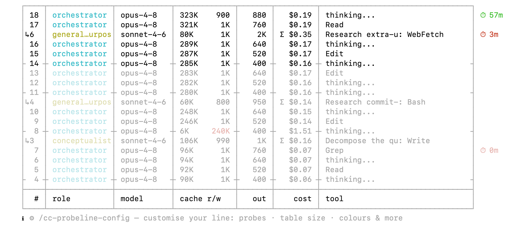
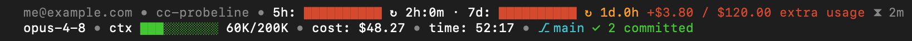
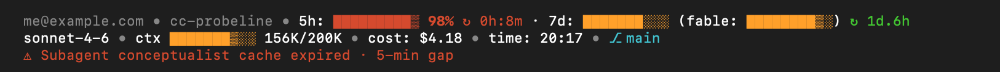
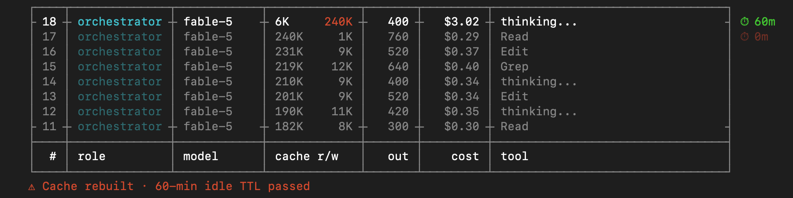

[](https://github.com/labzink/cc-probeline/releases)
[](https://github.com/labzink/cc-probeline/actions/workflows/test.yml)
[](LICENSE)


# cc-probeline

A status line for Claude Code that prices every turn — yours, your subagents', and every cache rebuild — reading the session log already on your disk. No account, no API key, no telemetry.

Session totals come from Claude Code itself; the per-turn breakdown is computed here from token counts against a public price table, and labelled as an estimate throughout.

It makes no network calls while it runs. Two optional, opt-out background actions exist: a once-a-day check of one public file on GitHub (current prices and the latest version), and — only if your plan has a model-scoped weekly limit or paid extra usage — a five-minutely refresh of Claude Code's own usage cache, done by running its `/usage` screen headlessly. Neither sends anything about your session. [Privacy policy →](PRIVACY.md)

**Spend your limits on purpose, instead of paying for inefficiency you can't see.**

**Install:**

```sh
brew install labzink/homebrew-tap/cc-probeline                                                   # macOS
curl -fsSL https://raw.githubusercontent.com/labzink/cc-probeline/main/scripts/install.sh | sh   # macOS / Linux
```

Windows (Scoop) and the Claude Code plugin marketplace: **[all install options →](#install)**. Every release ships with SHA256 checksums and [signed SLSA build provenance](#why-its-called-a-probe).


## What the probe pulls out

Most status lines count things — tokens, turns, running agents. **The probe prices them.** Everything below comes out of your session's local log: data Claude Code has, but never shows you.

- **Every turn, priced** — not one opaque session total: a live table where each step lands with its own cost.
- **What your subagents spend** — subagent work is invisible while it runs. The probe puts each agent on the bill, live, next to your own turns.
- **Cache rebuilds, in dollars** — idle past the TTL (60 min for the orchestrator, 5 for subagents), and your next turn quietly rewrites the whole cache. The probe ages it live (⏱ 60m → 0m) and prices the rebuild when it hits.
- **Extra usage in money, not percent** — once your plan is spent, the line shows what you have actually paid on top this month against your ceiling ($20.40 / $120.00), straight from Anthropic's own figure rather than an estimate.
- **Prices that stay correct** — your dollars are only as honest as the price table behind them. cc-probeline refreshes its rates over the network — one optional, opt-out check a day, never during render — so when Anthropic changes prices your totals follow within a day, no reinstall. Offline or opted out, it falls back to the table baked into the build.
- **5h / 7d limits with reset clocks** — watch them fill, know exactly when they free up. If your plan carries a model-scoped weekly limit (the "Fable" cap and its kin), it rides inside the weekly bar in brackets — Claude Code never puts it in the status-line feed at all, so the probe goes and gets it.
- **Colour-coded zones** — numbers shift colour as they enter warning and critical territory, so the line catches your eye exactly when it should.
- Plus the table stakes: model, context, git, session time.


**Every turn lands on its own line — orchestrator and subagents alike — priced as it happens. Finally you see where every dollar of your reasoning actually goes.**

**Built to fit your terminal.** Don't like a segment, the colours, or the width? The `/cc-probeline-config` wizard walks you through it and writes the config for you — no hand-editing TOML. (That's the hint at the bottom of the dashboard above.)


**The moment you cross 100%, you'll see it — and the extra bill stays under your control.**


**You get warned while there's still time to act — not after you've hit the wall.**


**Cache rebuilds stop being silent — you see the price the moment they happen.**

All of it read, none of it touched — that's [why it's called a probe](#why-its-called-a-probe).

## Why it's called a probe

A probe is an instrument of observation, not intervention. Everything cc-probeline does is read and display — it never reaches into your account or reports on you.

- **What it reads:** your session's JSONL log (`~/.claude/projects/…`) and the status-line payload Claude Code pipes directly to it.
- **What it doesn't touch:** credentials, keychain, OAuth tokens — no telemetry, ever. Rendering is fully offline. Its own only network call is one optional, opt-out price/version check a day — a plain download of a public file, sending nothing about your session. It can also ask Claude Code to refresh its usage cache in the background (`/usage`, headless, at most every five minutes, opt-out) so a model-scoped weekly limit stays current: that call is Claude Code's, with your credentials, and costs no model tokens. Turn both off and cc-probeline neither sends nor starts anything.
- **The binary:** single compiled Go binary, no runtime dependencies, one run ≈ 5 ms.
- **Auditable:** MIT license, open source, every release published with SHA256 checksums and signed build provenance (SLSA) — verify any download with `gh attestation verify <file> --repo labzink/cc-probeline`.

## Install

Every channel below does the same thing: install the binary **and** wire it into
your Claude Code status line. After installing, **restart Claude Code** and you're
done — no extra commands. (If you already have a custom status line, it's left
untouched; switch to cc-probeline with `cc-probeline install --merge-settings --force`.)

**Homebrew** (macOS — it's a cask; on Linux use curl below):

```sh
brew install labzink/homebrew-tap/cc-probeline
```

**curl** (macOS / Linux — downloads the release archive for your OS, verifies SHA256, installs the binary):

```sh
curl -fsSL https://raw.githubusercontent.com/labzink/cc-probeline/main/scripts/install.sh | sh
```

**Scoop** (Windows, experimental):

```powershell
scoop bucket add labzink https://github.com/labzink/scoop-bucket
scoop install cc-probeline
```

**Claude Code plugin marketplace:**

```
/plugin marketplace add labzink/cc-probeline
```

Then install the plugin from the `/plugin` menu (or `/plugin install cc-probeline`) and **restart Claude Code** — the slash commands below only show up after a restart.

Once restarted, run `/cc-probeline-install`: it detects your OS, installs the binary through the right channel (Homebrew / Scoop / curl) and wires the status line — asking before it runs anything. You can still install manually with any channel above. The plugin also gives you `/cc-probeline-update` to upgrade later and the `/cc-probeline-config` wizard.

**Verify your installation:**

```sh
cc-probeline --check
```

Prints `Installation OK`.

### Requirements

- Claude Code on macOS, Linux, or Windows.
- For the quota segment (5h / 7d limits, extra usage): Claude Code ≥ 2.1.80, which passes `rate_limits` in the status-line payload. On older versions the quota segment is hidden; everything else works normally.

### Configuration

Run the interactive wizard from inside Claude Code:

```
/cc-probeline-config
```

It walks you through probes, table size and background refresh — and writes the TOML for you. Or edit `~/.config/cc-probeline/config.toml` directly (validate with `cc-probeline check-config`):

```toml
[general]
table_rows    = 10          # rows in the per-turn cost table (max 40)
no_color      = false       # true = plain monochrome output
price_check   = true        # false = never fetch prices; use the table baked into the build
usage_refresh = true        # false = never run Claude Code's /usage in the background

[widgets]                   # flip any segment on/off
model = true
effort = true
cost = true
ctx = true
quota = true
git = true
project = true
email = true
time = true

[thresholds]
cost_budget_usd = 25        # turn the cost segment red past $25 (0 = off)

# Colour flips for the context bar — yellow / orange / red.
# Must strictly increase; bad values fall back to these defaults.
ctx_notice_ratio   = 0.50
ctx_warn_ratio     = 0.70
ctx_critical_ratio = 0.90

# Same three flips per rate-limit window. The 7d window mirrors these keys
# as quota_7d_notice_ratio / _warn_ratio / _critical_ratio.
quota_5h_notice_ratio   = 0.50
quota_5h_warn_ratio     = 0.70
quota_5h_critical_ratio = 0.90
```

Config is read in precedence order: `CC_PROBELINE_CONFIG=/path` (explicit override) → `.cc-probeline.toml` in the current repo (project-local) → `~/.config/cc-probeline/config.toml` (global). Every field is optional; missing fields use the built-in defaults, and an invalid value never breaks the status line — it falls back to the default.

Full reference: [`scripts/config.toml.example`](scripts/config.toml.example).

### Updating

When a newer release is out, the status line surfaces it: `↑ update: vX → vY — run /cc-probeline-update`. Run that command inside Claude Code and it upgrades through whichever channel you installed with (and installs it for you if the binary is missing). Or update by hand:

```sh
brew upgrade labzink/homebrew-tap/cc-probeline                                                   # Homebrew
scoop update cc-probeline                                                                        # Scoop
curl -fsSL https://raw.githubusercontent.com/labzink/cc-probeline/main/scripts/install.sh | sh   # curl (re-runs latest)
```

The update notice comes from a once-a-day price/version check; turn it off with `price_check = false` (or in the `/cc-probeline-config` wizard) and cc-probeline stays fully offline. Updating keeps your status-line wiring intact.

### Uninstall

Uninstalling restores the status line you had before (byte-for-byte, if cc-probeline replaced one) and removes the binary. Use the command for the channel you installed with — **restart Claude Code afterwards**:

```sh
brew uninstall cc-probeline                                                                            # Homebrew — also restores your previous status line
curl -fsSL https://raw.githubusercontent.com/labzink/cc-probeline/main/scripts/install.sh | sh -s -- --uninstall   # curl
```

**Scoop** (Windows): restore the status line first, then remove the binary — `scoop uninstall` can't run the restore step itself:

```powershell
cc-probeline uninstall
scoop uninstall cc-probeline
```

To only un-wire the status line without removing the binary, run `cc-probeline uninstall` on its own.

## How it was built

I built this for myself. I wanted to see under the hood of Claude Code — where the money and the limits actually go. A working version took a few days, and it was clear it wouldn't be useful only to me.

What came after went into making it a product rather than a prototype, not into more features. I didn't write the code — Claude Code wrote every line of it. My interest was elsewhere: building a development process with AI that actually holds up.

In practice that means concept and spec before code, work in phases against a fixed contract, and every call mine, reviewed detail by detail. The development itself runs as a process: a phase is split into isolated subtasks, each handled by its own subagent under a narrow contract, while an orchestrator agent collects the results and accepts the work. A phase fits into a single session, and its output always lands on disk — spec, plan, status, log — so the next session picks up exactly where the previous one stopped and nothing is lost to an overflowing context.

There was no ready-made pipeline for any of this, so I assembled it by hand: the agent roles and their briefs, the handoff format between sessions, the rules for accepting work. A sizeable share of the time went into the pipeline rather than into the product.

On top of it sit the guard tests: checks against real session data, and snapshots of the real rendered status line — so a fix doesn't mean re-checking everything by hand.

That's what the whole thing was for: code written by an AI that matches the vision and the design instead of drifting into mush. The commit history is public and reads like a build log — you can watch the project take shape, phase by phase.

**Contributing:** bug reports and ideas are welcome — open an issue. Code contributions are possible, but they're not the primary path: the codebase is developed through an AI pipeline in tight collaboration with the author, so pull requests need to fit that workflow. When in doubt, open an issue first.

If cc-probeline ends up saving you money, you can send a little of it back: [GitHub Sponsors](https://github.com/sponsors/labzink)

MIT License.
